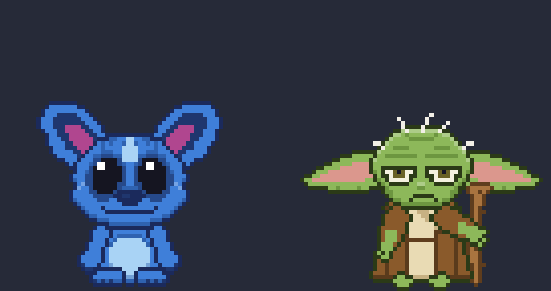
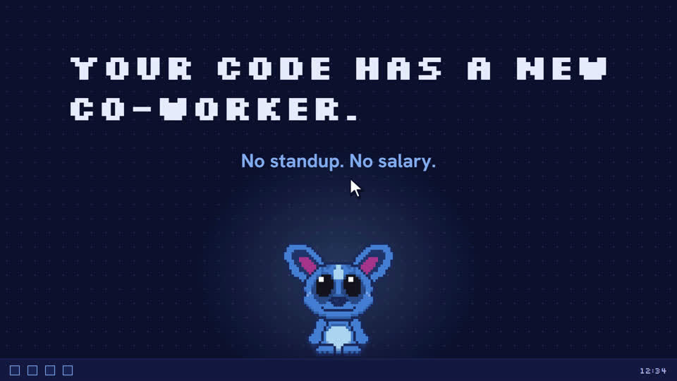
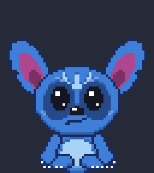
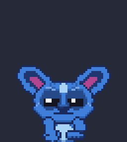
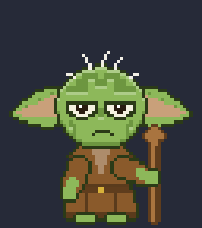
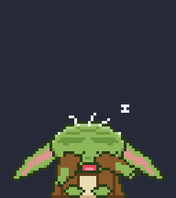
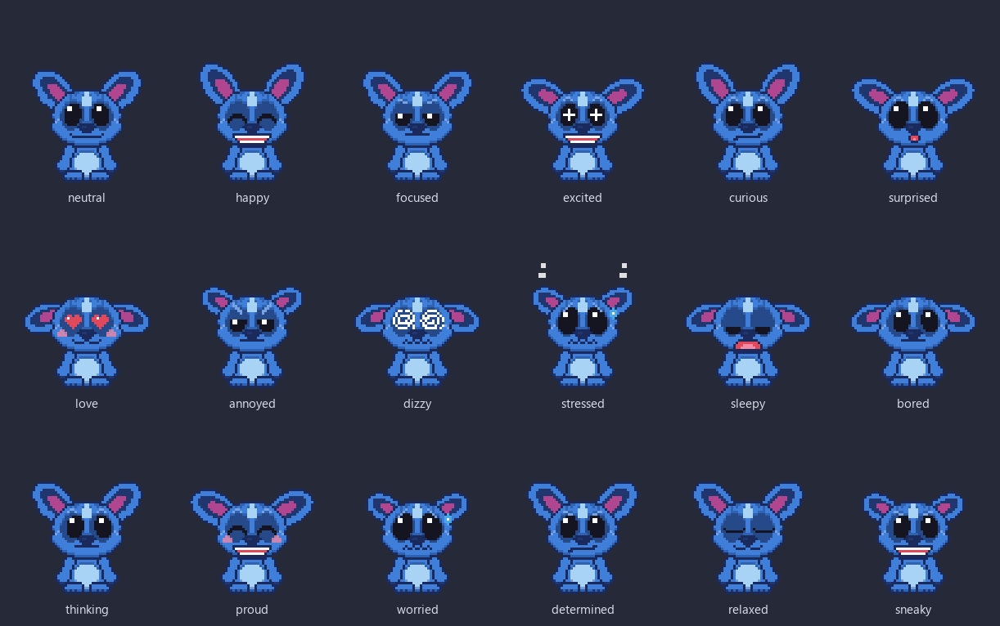
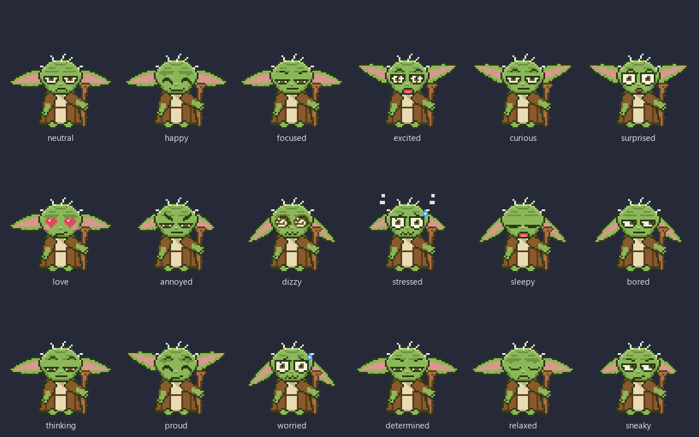

<div align="center">



# CodeCritter

**A tiny pixel companion that lives on your desktop, watches you code, and reacts to your AI agents.**

Free, open source, no telemetry. Windows installer is about 2 MB.

[**Download for Windows**](https://github.com/rsd-06/codecritter/releases/latest) · [Website](https://codecritter.vercel.app) · [AI agents](docs/agents.md) · [Make a character](docs/characters.md) · [Contributing](CONTRIBUTING.md)

<a href="docs/media/launch.mp4"></a>

<sub>▶ Watch the 20-second launch video</sub>

</div>

---

CodeCritter puts a small pixel character on top of your windows. It follows your cursor with its eyes, kneads the air while you type, gets hot when you type too fast, reminds you to stretch and drink water, runs your Pomodoro timer, and celebrates when your coding agent finishes a task. Inspired by desktop pets like Comnyang, but free, open source and built for developers.

Two characters ship in the box: **Stitch** and **Yoda** (unofficial fan art, see the [disclaimer](#disclaimer)). The character system is pluggable.

<p align="center">
  
  
  
  
</p>

## Features

| # | Feature | What it does |
| --- | --- | --- |
| 1 | Colours | Per-character palette editor with presets and a live preview |
| 2 | Eye follow | Pupils track your cursor across all monitors |
| 3 | Mochi drag | Grab and fling the critter; it squashes, stretches and wobbles |
| 4 | Mouse hunt | Whip the cursor past it and it crouches, wiggles and pounces |
| 5 | Purring pets | Rub the cursor back and forth over its head: hearts and a purr |
| 6 | Keyboard kneading | Typing makes it knead/type along (key counts only, never key content) |
| 7 | Overheat | Sustained fast typing turns it red and makes it steam |
| 8 | Stretch reminder | Grows big, stretches, and nags you politely |
| 9 | Water reminder | Holds up a cup on your schedule |
| 10 | Paper unroll | Scrolling unspools a paper roll (a scroll for Yoda) |
| 11 | Thinking along | Shows a thought bubble while your AI agent works |
| 12 | Agent done jump | Hops, chirps and shows a bubble when the agent finishes; alert pose on errors |
| 13 | Pomodoro | Focus/break/long-break loops with a pixel timer beside the critter and tray controls |
| 14 | Message reminders | Scheduled messages (once / daily / weekdays) with a sound |
| 15 | Fixed message | A pinned sticky note above its head |
| 16 | Your name | Bubbles use your name (Yoda keeps his syntax) |
| 17 | Settings sync | Export/import settings, or point at a sync folder to share them across machines |
| 18 | Peek mode | Hides at a screen edge and peeks out while fullscreen apps, videos and games are up, including browser F11 fullscreen; only reminders break through |

Extras: 18 expression presets per character, sleeps when you go idle, synthesised mechanical-keyboard style sounds (clacks for typing, agents and clicks; soft chimes for reminders that repeat louder until you react; a bell for Pomodoro; chirps for Stitch, hums for Yoda) with volume and per-category toggles, automatic signed updates (can be turned off), scale 1-4x, opacity, do-not-disturb hours, multi-monitor aware, global shortcuts, autostart, quiet by design.

## Characters

Every character is built from small pixel-grid parts and a palette, so colours are fully customisable. 18 expressions each:

**Stitch**



**Yoda**



Want to add your own? See [docs/characters.md](docs/characters.md).

## AI agent integration

CodeCritter listens on a tiny loopback-only HTTP endpoint. Agents report `thinking`, `tool`, `done`, `error` and `attention` events through a zero-dependency hook script. Open **Settings > Agents** and click **Install**: CodeCritter edits the agent's config for you (idempotently, with a backup, and it can uninstall just as cleanly).

| Agent | One-click install | Notes |
| --- | --- | --- |
| Claude Code | Yes | `~/.claude/settings.json` hooks |
| Codex CLI | Yes | `notify` command |
| Cursor | Yes | `~/.cursor/hooks.json` |
| Gemini CLI | Yes | Hooks in `~/.gemini/settings.json` |
| Antigravity | Yes | Shares Gemini's settings file |
| Kiro | Yes | User-level `.kiro.hook` files |
| GitHub Copilot CLI | Yes | `~/.copilot/hooks/codecritter.json` |
| OpenCode | Yes | Plugin in `~/.config/opencode/plugin/` |
| Devin and anything else | Manual | One `curl` call, see below |

Manual setup, exact file formats, the HTTP API and troubleshooting: [docs/agents.md](docs/agents.md).

## Install

### Download

Grab the latest build for your OS from the [Releases page](https://github.com/rsd-06/codecritter/releases):

- **Windows**: `CodeCritter_*_x64-setup.exe` (installer, per-user, no admin needed; about 2.1 MB) or `CodeCritter_*_x64_en-US.msi`. The installer downloads the Microsoft WebView2 runtime only if your PC lacks it (it ships with Windows 11 and current Windows 10).
- **macOS**: `CodeCritter_*_universal.dmg` (Apple Silicon + Intel, macOS 13+), or `brew install --cask rsd-06/tap/codecritter` once the tap is published. See [docs/macos.md](docs/macos.md) for the first-run steps (Input Monitoring permission).
- **Linux**: `.AppImage` (`chmod +x`, run) or `.deb`

> Windows builds are **unsigned** and macOS builds are **ad-hoc signed, not notarized** for now. Windows SmartScreen shows "Windows protected your PC": click **More info > Run anyway**. On macOS right-click the app, choose **Open**, then confirm (or run `xattr -dr com.apple.quarantine /Applications/CodeCritter.app`). CodeCritter is a menu-bar/tray app and has no Dock icon.

### Build from source

CodeCritter is a [Tauri 2](https://tauri.app) app: a Rust shell around a TypeScript/Canvas/React front end. You need Node 22+, a stable Rust toolchain ([rustup](https://rustup.rs)), and the platform prerequisites from the [Tauri guide](https://tauri.app/start/prerequisites/) (MSVC Build Tools + WebView2 on Windows, Xcode CLT on macOS, `libwebkit2gtk-4.1-dev libayatana-appindicator3-dev librsvg2-dev patchelf libxdo-dev libxtst-dev` on Debian/Ubuntu). Python 3.10+ is only needed to regenerate image assets.

```sh
git clone https://github.com/rsd-06/codecritter.git
cd codecritter
npm ci
npm run dev            # tauri dev: the app with hot reload
npm run dist           # tauri build: installers in <target>/release/bundle/ (nsis + msi on Windows)
npm run test:rust      # Rust unit tests
```

Regenerate icons, tray images and README media from the character definitions (needs a Python venv with Pillow):

```sh
python -m venv .venv
.venv\Scripts\pip install -r tools\requirements.txt      # Windows (use .venv/bin/pip on macOS/Linux)
npm run sprites:export                                    # render frames with the real engine
.venv\Scripts\python.exe tools\make_icons.py              # icons, tray PNGs, docs/media
npx tauri icon build/icon.png                             # regenerate src-tauri/icons
```

## Usage

- **Tray / menu-bar icon**: switch character, start/pause/skip/stop Pomodoro, peek mode, pause reactions, mute, hide/show, Settings, Quit. The tray icon follows the selected character.
- **Right-click the critter** for the same menu. **Drag** it anywhere; its position is remembered per monitor.
- **Shortcuts** (global): `Ctrl/Cmd+Alt+P` toggle peek, `Ctrl/Cmd+Alt+H` hide/show, `Ctrl/Cmd+Alt+S` open Settings.
- **Settings window**: character and colours, reactions, reminders, Pomodoro, messages, pinned note, agents, general (name, size, opacity, sound, autostart, do-not-disturb, peek, sync).
- **Config file**: `settings.json` in the app config folder: `%APPDATA%\dev.codecritter.app\settings.json` on Windows, `~/Library/Application Support/dev.codecritter.app/settings.json` on macOS, `~/.config/dev.codecritter.app/settings.json` on Linux. The agent token and port live in `~/.codecritter/`.

## Privacy

Privacy is a feature, not a footnote.

- **No telemetry, no analytics.** The only network request CodeCritter ever makes is the update check: a plain HTTPS GET of `latest.json` from this repository's GitHub Releases, with no identifiers and nothing about you or your usage. Turn it off in Settings > General > Automatic updates (then it never connects at all), or check by hand with "Check for updates now".
- **Updates are signature-verified.** New versions are downloaded in the background and installed only after their minisign signature matches the public key built into the app, then installed when you are idle (2+ minutes, no Pomodoro running) or when you quit from the tray. The critter tells you afterwards.
- **Keystrokes are never recorded.** The global input hook is aggregated in the Rust shell into counts and rates (keys per second, scroll delta, mouse speed). Key identities never leave the input hook and are never stored or logged.
- **Loopback only.** The agent endpoint binds to `127.0.0.1`, requires a random per-install token, rejects browser requests, and is rate limited. Events can only animate the critter.
- Agent messages (for speech bubbles) are shown and discarded; they are not stored.

See [SECURITY.md](SECURITY.md) for the threat model.

## Performance

Efficiency is a design goal: no animation loop while idle (a dirty-flag scheduler redraws ~1-2 times per second at rest and at most ~12 fps while animating), software rendering with a single WebView2 renderer process, adaptive cursor polling, and the Settings window is destroyed when closed. The Rust shell uses a few MB on its own. Measured on a Windows 11 box with the **release build installed from the NSIS installer** (idle, overlay visible, about 20 s after launch):

| Metric | Result |
| --- | --- |
| Installer size | NSIS 2.1 MB, MSI 2.9 MB |
| CPU (idle) | ~0.0% |
| Private working set (the Task Manager "Memory" column, app + WebView2 processes) | ~60 MB |
| Private bytes (committed, unshared) | ~91 MB |
| Total working set (counts shared WebView2/Chromium DLL pages) | ~280 MB across 6 processes (the Electron build measured ~190-220 MB with the same method, but ~110 MB private) |
| Idle redraws | ~1.2-1.4 per second (0.8 while asleep) |

Honest note: the WebView2 runtime is shared with Edge and other apps, so the shared-page "working set" is larger than Electron's even though real (private) memory is roughly half. `CRITTER_DEBUG=1` prints input/reminder diagnostics.

## Roadmap

- Code-signed Windows and macOS builds
- More built-in characters and a drop-in character pack loader
- Per-monitor and per-app behaviour rules
- Localised strings (the text layer is already i18n-ready)
- Linux peek detection (fullscreen heuristics) parity with Windows and macOS

## Contributing

Issues and pull requests are welcome. Start with [CONTRIBUTING.md](CONTRIBUTING.md) (dev setup, scripts, architecture, commit style, how to test agent installers safely) and the architecture notes in [docs/PLAN.md](docs/PLAN.md).

## License

[MIT](LICENSE) for the code. Character artwork is unofficial fan art, see below.

## Disclaimer

CodeCritter is an independent, unofficial, non-commercial fan project. **Stitch is a character of and copyright (c) Disney. Yoda is a character of and copyright (c) Lucasfilm Ltd.** All rights belong to their respective owners. CodeCritter is **not affiliated with, endorsed by or sponsored by** Disney, Lucasfilm, or any of the AI-agent or desktop-pet products mentioned here. The characters are plain pixel-art data and the character system is pluggable, so they can be swapped for original characters at any time. The MIT license covers the source code only, not the third-party characters it depicts.

Launch video music: "Happy Beats / Business Moves vol. 9" by [ende.app](https://ende.app/en), CC BY 4.0.
