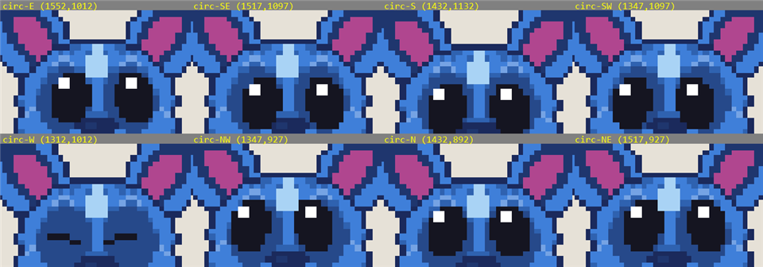
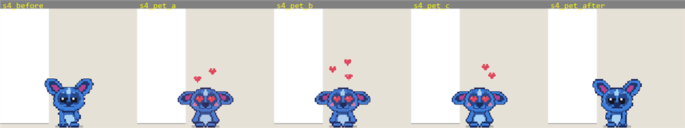
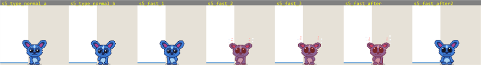
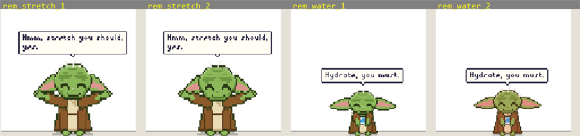
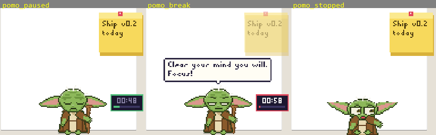
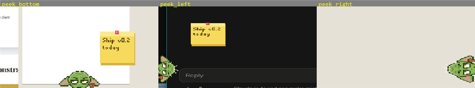
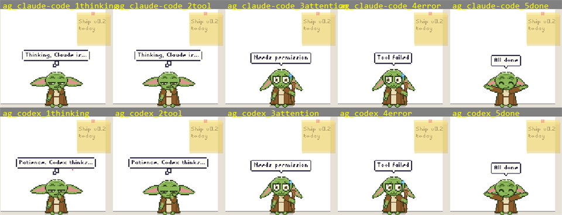
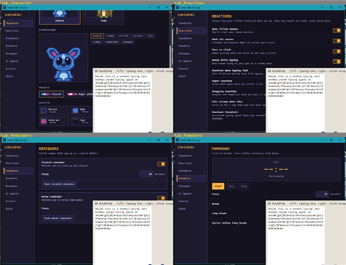

# CodeCritter v0.2 QA: scripted mock run (Tauri release build)

Build under test: `npm run dist` (release exe 4.19 MB, NSIS 1.50 MiB, MSI 2.11 MiB) from commit `9848b5d`; fixes found during the
run were rebuilt (`tauri build --no-bundle`) and re-verified on the exe. Machine: Windows 11 (10.0.26200), one monitor 1920x1080 at
125% scaling (1536x864 logical), 12 logical cores. Date 2026-10-05.

## How it was run

- Everything is driven by real OS input: `SendInput` mouse moves / clicks / wheel / Unicode key events, global chords
  (Ctrl+Alt+P/H/S) and the native tray / context menus. Frames are `CopyFromScreen` crops with `SetProcessDPIAware`, judged by eye
  (and by pixel diffs where noted). Settings-window actions were driven through WebView2 remote debugging (`CDP`, DOM clicks and
  value sets); its screenshots are of the real window.
- The app ran with a temp `USERPROFILE`/`APPDATA`/`LOCALAPPDATA` (`D:\dev-cache\qa\home`), so settings, WebView2 profile and the
  sync folder were isolated. **Exception:** `dirs::home_dir()` ignores `USERPROFILE` on Windows (it uses the known-folder API), so the
  agent token/port files were the real `~/.codecritter` ones (token reused, never regenerated; backed up before and verified
  byte-identical afterwards; only the `port` mtime changed). No agent hook was installed into any real agent config; the real
  Claude Code integration is out of scope here.
- Typing / click-through targets are a small topmost WinForms "backdrop" (text box + click logger) instead of Notepad: the Store
  Notepad restores session tabs containing user text, and the desktop is shared with a live user. The overlay was re-raised with
  `SetWindowPos(HWND_TOPMOST)` before frames because other topmost windows (backdrop, tray flyout) reorder.
- **Caveat: shared desktop.** A real person was using the mouse/keyboard/snipping tool during the run. That caused a handful of
  non-reproducible failures (drag that did not start, character "missing" because it was peeking, cursor displaced), each re-run
  cleanly in a controlled retry, and it prevented a real 300 s idle run (scenario 6).
- Raw frames: `D:\dev-cache\qa\shots\` (352 PNGs); scripts: `D:\dev-cache\qa\lib.ps1`, `measure.ps1`, `cdp.mjs`.
  The 8 most informative crops are in `docs/media/qa/`.

## Results

PASS 14, PARTIAL 2, N.A. 0 (scenarios); see notes for the exact scope of each.

| # | Scenario | Result | Evidence | Notes |
| --- | --- | --- | --- | --- |
| 1 | Startup: visible, transparent, bottom-right left of tray, idle animation, tray icon | PASS | `shots/s1_overlay.png`, `idl_m.png`, `tray_flyout.png` | Overlay 320x280 px (128x112 stage x 2 x 1.25 DPI) at x=1275, y=800 on first run: flush with the bottom edge, 325 px (260 logical) from the right. User's browser is visible through it. Idle animation: frames alternate between two poses (666 sampled px differ between them) = breathing bob. Tray icon: UI Automation lists a `CodeCritter` button in the overflow flyout; `NotifyIconSettings` registered. |
| 2 | Cursor: far / near / over eyes / between / circling | PASS | , `s2_far.png`, `s2_near.png`, `s2_yoda.png` | Stitch: 8 far directions, 9 near spots and an 8-point circle: pupil highlight and head turn follow the cursor in every direction; eyes widen when the cursor is within ~150 px; pupils never leave the eye patch. Caveat: Stitch's eyes are solid dark patches with one white glint, so direction is a 1-2 logical px glint shift (hard to judge dead-centre over an eye). Yoda (visible irises): iris moves about +7 px (screen) from far-W to far-E. |
| 3 | Click-through | PASS | log in this table, `s3_after.png` | 8 probes: over transparent pixels `WS_EX_TRANSPARENT` is set, `WindowFromPoint` returns the window beneath and the click reaches it; over ear / head / belly the flag clears, the point resolves to the overlay webview and the backdrop receives nothing (0/6 repeat run, 6 moves from a transparent spot each time). |
| 4 | Petting, drag, shake, right-click | PASS | , `s4_drag_mid.png`, `s4_shake_m.png`, `s4_ctx.png` | Rubbing the head (8+ reversals) gives heart eyes, flattened ears, rising hearts; recovers ~3 s later. Drag: six controlled drags moved the window by exactly the cursor delta (e.g. -200,-120) and `settings.position` followed (re-read after restart). Shake while dragging: spiral eyes, sweat, stays dizzy after release then recovers. Right-click: menu with Stitch/Yoda, Pomodoro submenu, Peek, Pause, Mute, Hide/show, Settings, Quit. Hunt (fast cursor near the character): crouch/pounce reaction seen (`hunt_m.png`). |
| 5 | Typing, burst, scroll, fast mouse | PASS | , `k_m.png`, `sc_m.png`, `mf_m.png` | Normal typing (~7 cps): head looks down, paws alternate. 28 cps burst: after about 4 s red tint + steam (overheat), back to normal ~3 s after stopping. Wheel x3 s: paper roll at the belly. Fast mouse (logged `mouse=3500`): surprised face, arms up, recovers in ~1 s. Typed into the backdrop text box (197 chars received), not Notepad. |
| 6 | Idle -> sleep, wake on input | PARTIAL | `idle2_m.png`, `sl2_m.png`, `sl5_m.png` | Real idle: "bored" (ears drooped) at 135 s and 225 s idle. Real 300 s was never reached because the human's input kept resetting the global idle clock (three attempts). Sleep rendering was verified by injecting an `idleMs=310000` input sample over CDP with reactions paused (the real stream is silent while paused): curled / ears-down sleep pose; after un-pausing, the next real input wakes it immediately. The 120 s / 300 s thresholds are constants (not a setting) and unit-tested. |
| 7 | Reminders, DND, scheduled message, once | PASS | , `wr_m.png`, `rem_m.png` | Test buttons: stretch (arms up, grown) and water (cup) with Yoda strings. 1-min intervals fired on schedule (log `[critter] reminder`). DND window covering now: 0 reminders in 110 s; switching DND off, the next one fired after 11 s. Message at the next minute fired ("QA scheduled hello", wave pose); `repeat: once` disabled itself in settings.json. Issue O1 (collision) below. |
| 8 | Pomodoro | PASS | , `pomo_focus_*.png` | 1/1 minute cycle started from the context-menu submenu: timer widget with progress bar and bubble, Settings tab shows `FOCUS 00:58 Cycle 1`; natural focus -> break transition observed; Pause freezes (00:48 held for 3 s), Resume continues, Skip phase (break -> focus, cycle 2), Stop -> IDLE, widget disappears. |
| 9 | Pinned note, name greeting, bubbles on the smaller head | PASS | `wr_m.png`, `rem_m.png` | Pinned note (sticky) top right, fades while a bubble is shown; "Hydrate, Sudharshan, you must." / "Thirsty you are, Sudharshan. Drink!"; bubble tail anchored above the head and follows it (lower when Yoda crouches). |
| 10 | Peek: manual bottom / left / right, auto with fullscreen | PASS | , `peek_auto.png` | Ctrl+Alt+P: bottom y 800 -> 912, left x -> -128 (rotated head), right x -> 1728, each restored to the exact pre-peek position and never persisted (`position` stayed 1259,800). Auto: a borderless full-screen window gave `SHQueryUserNotificationState=2`, log `peek ON (fullscreen app)`, window slid down; closing it restored (`peek off`). The detector also fired on the user's own full-screen / snipping UI. |
| 11 | AI agent events + API | PASS | , `ag_m1..5.png`, `hook_m.png` | All 10 agent ids x thinking / tool / attention / error / done = 50 requests, all 200: thinking = chin-hand + "Thinking, <Agent> is..." bubble (name per agent), tool keeps thinking, attention/error = alarmed face + message bubble, done = happy hop + message. `idle` has no visual by design. HTTP: bad token 401, empty token 401, bad JSON 400, bad type 400, unknown agent -> generic 200, wrong path 404, 20 kB body 413, `Origin` header 403, 80 requests in 0.75 s = 46x200 + 34x429, `/v1/health` 200 `{"version":"0.2.0"}`. `node bin/critter-hook.mjs claude-code auto` with UserPromptSubmit / PreToolUse / Notification / Stop JSON on stdin: exit 0, empty stdout, 110-130 ms, bubbles show the prompt/notification/last-message text; with an empty `CRITTER_HOME` it exits 0 and prints only "no token" under `CRITTER_DEBUG`. Agent installers are not exercised against real home dirs (covered by the Rust tests). |
| 12 | Settings window | PASS (after fixes) | , `tab_*.png`, `scales_m.png`, `opacity50.png`, `export_dialog2.png` | All 8 tabs render. Stitch <-> Yoda, scale 1/2/3/4 (window 160/320/480/640 px wide), opacity 50%, sound/volume, reaction toggles, user name, pinned note, DND: all written to settings.json and applied live; identical `settings.json` after a full restart (character, scale 3, opacity, position, toggles). Export via the real Save As dialog and Import via Open: round-trip restored name and scale, syncFolder kept local, token/position excluded from the file. Sync folder: file written within 2 s; external edit applied live. Bugs B1-B3 found and fixed. |
| 13 | Tray menu, 3 global shortcuts, start at login | PASS | `tray_menu5.png`, `tray_flyout.png`, `ctx_state2.png` | Ctrl+Alt+P toggles peek, Ctrl+Alt+H hides/shows (overlay window `IsWindowVisible` false/true), Ctrl+Alt+S opens Settings (each logged `[shortcuts] fired`). Tray menu (right-click on the overflow icon) has the same items, checks match state (Yoda, Mute), and clicking Stitch switched the character; Peek / Hide / Pause items were exercised through the identical context menu (check marks verified). Start with Windows: ON writes `HKCU\...\Run\CodeCritter = <exe path>`, OFF removes it; Run key left exactly as found. Note: the first right-click on a Win11 overflow icon often only focuses it; harness issue, not an app bug. |
| 14 | Multi-monitor / DPI | PARTIAL | `scales_m.png` | Only one monitor (125% DPI), so multi-monitor, monitor hot-unplug re-clamp and mixed DPI could not be run. Scale change keeps the bottom-centre anchor: window centre x = 1419 and bottom = 1080 at all four scales. |
| 15 | Metrics | PASS | table below | Idle working set 276 MB (6 processes), private bytes 85 MB, Task-Manager private WS 55 MB, CPU about 1% of one core idle. |
| 16 | NSIS installer | PASS | transcript below | Silent install to `D:\dev-cache\tmp\cc-install` OK; launched from the install dir: `/v1/health` 200 `0.2.0`, event 200 with a bubble, `bin\critter-hook.mjs` present; uninstall removes the exe, uninstall entry and Start-menu shortcut. Two cosmetic leftovers (O5). |

### Scenario 3 probe log

```
transparent top-left   (1290,815)  WS_EX_TRANSPARENT=True   hwnd=textbox beneath  backdrop got click=0 (textbox owns it)
transparent right-mid  (1580,950)  WS_EX_TRANSPARENT=True   hwnd=backdrop          backdrop got click=1
transparent left-mid   (1300,1000) WS_EX_TRANSPARENT=True   hwnd=textbox beneath
character head         (1432,1000) WS_EX_TRANSPARENT=False  hwnd=overlay webview    backdrop got click=0
character belly        (1435,1050) WS_EX_TRANSPARENT=False  hwnd=overlay webview    backdrop got click=0
character ear          (1390,975)  WS_EX_TRANSPARENT=False  hwnd=overlay webview    backdrop got click=0
transparent above head (1432,830)  WS_EX_TRANSPARENT=True   hwnd=backdrop          backdrop got click=1
transparent far        (1100,700)  WS_EX_TRANSPARENT=True   hwnd=textbox beneath
```

### Metrics (release exe, overlay only, `measure.ps1`: process tree by parent PID, CIM counters)

| Case | Procs | Working set | Private bytes | Private WS (Task Manager "Memory") | CPU |
| --- | --- | --- | --- | --- | --- |
| Idle 60 s (zero input) | 6 | 275.8 MB | 84.9 MB | 55.3 MB | 2.22% of one core (0.19% of 12 cores) |
| Idle 45 s, second run (zero input) | 6 | 276.1 MB | 84.8 MB | 55.1 MB | 1.06% of one core (0.09% of 12 cores) |
| Typing burst ~17 cps for 7 s (10 s window, overheat visible) | 6 | 277.1 MB | 85.5 MB | 56.0 MB | 5.72% of one core averaged over the window (about 8% during the burst) |
| Installed build, idle 20 s | 6 | 283.6 MB | 94.6 MB | 62.5 MB | 2.13% of one core |

These match the T3 numbers (282 / 91 / 60 MB). Idle CPU is about 1% of one core (12 fps idle animation), not 0.0%. Total working set
stays above the 100 MB goal; only private working set meets it. No growth during the run (277 MB after hundreds of events).
Installer: NSIS 1.50 MiB, MSI 2.11 MiB; no errors, warnings or panics in the 5300-line debug log.

### Installer transcript

```
CodeCritter_0.2.0_x64-setup.exe /S /D=D:\dev-cache\tmp\cc-install   exit 0
  installed: codecritter.exe (4,188,672 B), uninstall.exe, bin\critter-hook.mjs
  HKCU Uninstall: CodeCritter 0.2.0, publisher rsd-06, InstallLocation = install dir
  Start menu: Programs\CodeCritter\CodeCritter.lnk
launch from install dir -> overlay window, /v1/health 200 {"ok":true,"version":"0.2.0","name":"codecritter"}
uninstall.exe /S   exit 0
  install dir: only a foreign leftover `codecritter.exe.WebView2` (from an older T3 run, created 09:53) remained -> deleted by hand
  uninstall key, Start-menu entry, Run key: removed; no processes left
  HKCU\Software\rsd-06\CodeCritter (default = install dir) remained -> deleted by hand
```

## Bugs

### Fixed (one commit each)

| ID | Severity | Bug | Commit |
| --- | --- | --- | --- |
| B1 | Low | Settings > About showed "v0.1.0" while the app is 0.2.0 (hard-coded string). Now injected from `package.json` via a Vite `define`. Verified in the rebuilt exe: "CodeCritter v0.2.0". | `fix(settings): show the real app version on the About tab` |
| B2 | Medium | The open Settings window never learned about changes made elsewhere: a `once` message disabling itself still showed Enabled, and the next Messages edit would send the stale list and **re-enable the fired message**; the same for tray character switches, sync-folder pulls and imports. Added optional `SettingsBridge.onSettings` (Tauri bridge already had the event), App subscribes (ignoring events while its own saves are in flight) and the Messages tab adopts external changes when it has no unsaved edits. Verified live: after the scheduler disabled the message the UI flipped to unchecked without re-opening. | `fix(settings): show settings changed elsewhere in the open Settings window` |
| B3 | Medium | A UTF-8 BOM in the sync file or an imported file (Notepad, PowerShell `Set-Content -Encoding UTF8`) made `serde_json` fail, so the edit/import was silently ignored. Now stripped in `merge_imported` and `store::init`; unit test extended; verified live (BOM-prefixed edit applied within 6 s). | `fix(sync): accept a UTF-8 BOM in imported and synced settings` |

Quality gate before committing: `npm run typecheck && npm test (118) && npm run lint && npm run build && npm run test:rust (82)` all green.

### Open (not fixed), by severity

1. **O1 (Low-Medium)** Simultaneous reminders collide: with stretch and water both on a 1-minute interval they fire in the same 20 s
   tick and only the last bubble (water) is ever visible; stretch is lost. With the defaults (50 / 40 min) they coincide every
   200 min. A short queue (or a 1-2 s stagger) would fix it; behaviour/design question, so left.
2. **O2 (Low)** While peeking, cursor sampling stops, so the visible head of the peeking character is never interactive (cannot
   right-click or drag it); leaving peek needs the tray, Ctrl+Alt+P or the end of the fullscreen app. Probably intentional, but not
   documented. The pinned note also stays on screen during peek although PLAN.md says only reminders are shown.
3. **O3 (Low, test gap)** The real 300 s idle -> sleep transition could not be observed end to end on a shared desktop (see
   scenario 6); the lead may want to repeat it on a quiet machine: leave the mouse and keyboard alone for 5.5 minutes with
   `CRITTER_DEBUG=1`.
4. **O4 (Info)** One unexplained observation: the overlay was found once in the peeked position (y=912) with no `peek ON` log line
   (manual toggles are not logged, so a person pressing Ctrl+Alt+P / the tray item is the likely cause). Ctrl+Alt+P restored it.
5. **O5 (Low, installer)** After a silent uninstall `HKCU\Software\rsd-06\CodeCritter` (default value = install dir) stays behind, and
   any foreign directory in the install folder keeps the folder alive (the uninstaller only removes what it installed). Cosmetic;
   comes from the Tauri NSIS template.
6. **O6 (Info)** Idle CPU is about 1% of one core (animation at 12 fps), not the 0.0% claimed in T3 notes; total working set 276 MB
   vs the <100 MB goal (private working set 55 MB meets it).
7. **O7 (Info, test harness)** `dirs::home_dir()` ignores `USERPROFILE` on Windows, so agent token/port files cannot be sandboxed
   with an env var; QA used the real `~/.codecritter` read-only. If sandboxing matters, honour a `CRITTER_HOME` override in the
   Rust server as the hook script already does.
